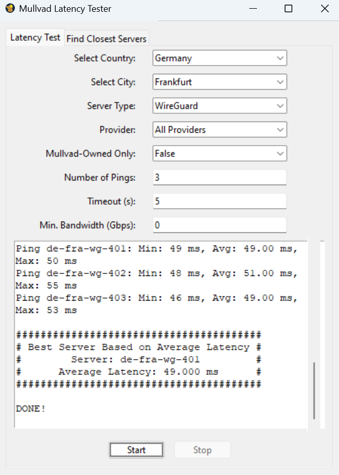
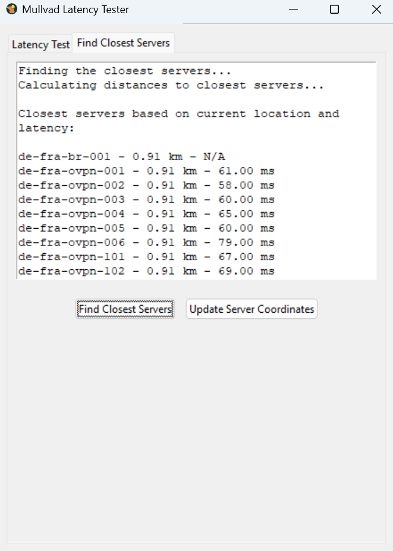

# Mullvad Latency Tester

This project provides a GUI tool to measure the latency of Mullvad VPN servers. It allows users to quickly find the best server based on geographic proximity and latency.

## Features

### Latency Test Tab
- Allows you to select country, city, and server type (WireGuard, OpenVPN, or Bridge).
- Performs multiple ping tests to selected servers and displays the results in the GUI.

### Find Closest Servers Tab
- Automatically identifies your current location and calculates the distance to various Mullvad VPN servers.
- Displays the closest servers based on distance and latency.

### Server Coordinate Updates
- Uses OpenStreetMap to fetch and update the geographic coordinates of servers as needed.

## Download

You can download the latest version of the executable from the [Releases](https://github.com/h4us91/mullvad-latency-tester/releases) section.
